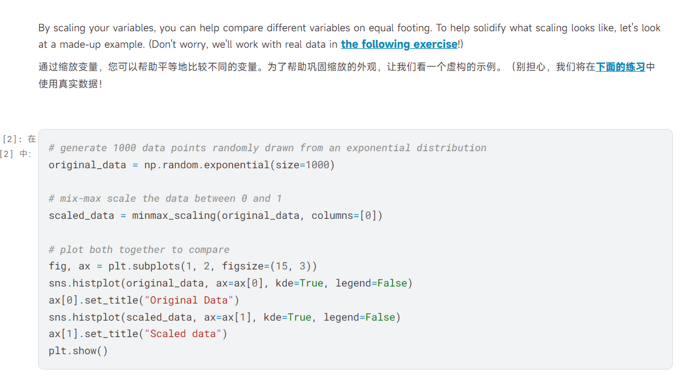

##  scale使用的函数



``` python
# generate 1000 data points randomly drawn from an exponential distribution
original_data = np.random.exponential(size=1000)

# mix-max scale the data between 0 and 1
scaled_data = minmax_scaling(original_data, columns=[0])

# plot both together to compare
fig, ax = plt.subplots(1, 2, figsize=(15, 3))
sns.histplot(original_data, ax=ax[0], kde=True, legend=False)
ax[0].set_title("Original Data")
sns.histplot(scaled_data, ax=ax[1], kde=True, legend=False)
ax[1].set_title("Scaled data")
plt.show()
```

## normalize使用的函数

其中的`normalized_data = stats.boxcox(original_data)`是用来对数据进行归一化的。

``` python
# normalize the exponential data with boxcox
normalized_data = stats.boxcox(original_data)

# plot both together to compare
fig, ax=plt.subplots(1, 2, figsize=(15, 3))
sns.histplot(original_data, ax=ax[0], kde=True, legend=False)
ax[0].set_title("Original Data")
sns.histplot(normalized_data[0], ax=ax[1], kde=True, legend=False)
ax[1].set_title("Normalized data")
plt.show()
```

## 关于subplots函数

这行代码使用 `matplotlib` 库创建了一个包含两个子图的图形对象。具体来说，它创建了一个图形对象（`fig`）和一个包含两个子图（`ax`）的数组。下面是每个部分的详细解释：

### 代码详细解释

```python
fig, ax = plt.subplots(1, 2, figsize=(15, 3))
```

#### 1. `plt.subplots(1, 2)`

- **`plt.subplots()`**：这是 `matplotlib` 中的一个函数，用于创建一个包含多个子图的图形对象。它返回一个包含两个对象的元组：
  - `fig`：图形对象（`Figure`），代表整个图形（包括所有子图）。
  - `ax`：子图对象（`Axes`）或子图对象的数组，代表图形中的一个或多个子图。

- **`1, 2`**：这些参数表示子图的布局。具体来说：
  - `1` 表示在图形中创建 1 行子图。
  - `2` 表示在图形中创建 2 列子图。
  - 因此，这里创建了一个 1x2 的布局，包含 2 个子图。

#### 2. `figsize=(15, 3)`

- **`figsize=(15, 3)`**：这个参数用于设置图形的大小。
  - `figsize` 是一个元组，表示图形的宽度和高度，单位是英寸。
  - `15` 表示图形的宽度为 15 英寸。
  - `3` 表示图形的高度为 3 英寸。
  - 这意味着生成的图形将是宽而矮的。

#### 3. `fig, ax`

- **`fig`**：`fig` 是 `Figure` 对象，表示整个图形。可以用它来设置图形的全局属性，如标题、图例等。
- **`ax`**：`ax` 是 `Axes` 对象的数组，这里包含了两个 `Axes` 对象。每个 `Axes` 对象代表一个子图，可以在其上绘制不同的内容。

  因为有 2 个子图，所以 `ax` 是一个包含两个 `Axes` 对象的数组（或 Python 列表）。你可以通过 `ax[0]` 和 `ax[1]` 分别访问和操作这两个子图。

### 示例

假设你要在这两个子图中分别绘制两条不同的曲线，可以这样做：

```python
import matplotlib.pyplot as plt

# 创建一个包含2个子图的图形对象
fig, ax = plt.subplots(1, 2, figsize=(15, 3))

# 在第一个子图中绘制数据
ax[0].plot([1, 2, 3, 4], [10, 20, 25, 30])
ax[0].set_title("Plot 1")

# 在第二个子图中绘制数据
ax[1].plot([1, 2, 3, 4], [30, 25, 20, 10])
ax[1].set_title("Plot 2")

# 显示图形
plt.show()
```

在这个例子中：
- 第一个子图（`ax[0]`）显示了上升趋势的曲线。
- 第二个子图（`ax[1]`）显示了下降趋势的曲线。

### 总结

这行代码 `fig, ax = plt.subplots(1, 2, figsize=(15, 3))` 创建了一个包含 2 个子图的图形对象，图形的尺寸为 15 英寸宽、3 英寸高。`ax` 是一个包含两个子图的 `Axes` 对象数组，您可以在每个子图上绘制不同的图形内容。这种布局适合在一个图形中并排展示多个图表或比较不同的数据可视化效果。